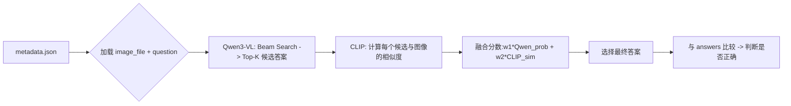

# 白宇计算机视觉课作业过程记录2025.12.24

# ==第一部分：复现Qwen3-VL  CLIP 模型==

## ==1.本地Qwen==

**1.打开Anaconda Prompt，创建并激活环境：**

```ba
# 创建环境
conda create -n qwen3_local python=3.10 -y
conda activate qwen3_local

# 安装支持量化的核心库
pip install torch torchvision torchaudio --index-url https://download.pytorch.org/whl/cu121

# 安装transforms库
pip install git+https://github.com/huggingface/transformers.git
如果安装报错那就https://github.com/huggingface/transformers手动Donwold ZIP解压到一个文件夹中，在cmd种进入这个文件夹，执行：pip install -e . 安装到本地

pip install accelerate bitsandbytes optimum

pip install sentencepiece pillow
```

```bash
# 包版本信息
(qwen3_local) D:\qwen3_deploy>conda list
# packages in environment at C:\Users\kuanzhang\.conda\envs\qwen3_local:
#
# Name                    Version                   Build  Channel
accelerate                1.12.0                   pypi_0    pypi
bitsandbytes              0.49.0                   pypi_0    pypi
bzip2                     1.0.8                h2bbff1b_6
ca-certificates           2025.12.2            haa95532_0
certifi                   2025.11.12               pypi_0    pypi
charset-normalizer        3.4.4                    pypi_0    pypi
colorama                  0.4.6                    pypi_0    pypi
expat                     2.7.3                h885b0b7_4
filelock                  3.20.0                   pypi_0    pypi
fsspec                    2025.12.0                pypi_0    pypi
huggingface-hub           0.36.0                   pypi_0    pypi
idna                      3.11                     pypi_0    pypi
jinja2                    3.1.6                    pypi_0    pypi
libexpat                  2.7.3                h885b0b7_4
libffi                    3.4.4                hd77b12b_1
libzlib                   1.3.1                h02ab6af_0
markupsafe                2.1.5                    pypi_0    pypi
mpmath                    1.3.0                    pypi_0    pypi
networkx                  3.4.2                    pypi_0    pypi
numpy                     2.2.6                    pypi_0    pypi
openssl                   3.0.18               h543e019_0
optimum                   2.1.0                    pypi_0    pypi
packaging                 25.0                     pypi_0    pypi
pillow                    12.0.0                   pypi_0    pypi
pip                       25.3               pyhc872135_0
psutil                    7.2.0                    pypi_0    pypi
python                    3.10.19              h981015d_0
pyyaml                    6.0.3                    pypi_0    pypi
regex                     2025.11.3                pypi_0    pypi
requests                  2.32.5                   pypi_0    pypi
safetensors               0.7.0                    pypi_0    pypi
sentencepiece             0.2.1                    pypi_0    pypi
setuptools                80.9.0          py310haa95532_0
sqlite                    3.51.0               hda9a48d_0
sympy                     1.13.1                   pypi_0    pypi
tk                        8.6.15               hf199647_0
tokenizers                0.22.1                   pypi_0    pypi
torch                     2.5.1+cu121              pypi_0    pypi
torchaudio                2.5.1+cu121              pypi_0    pypi
torchvision               0.20.1+cu121             pypi_0    pypi
tqdm                      4.67.1                   pypi_0    pypi
transformers              4.57.3                   pypi_0    pypi
typing-extensions         4.15.0                   pypi_0    pypi
tzdata                    2025b                h04d1e81_0
ucrt                      10.0.22621.0         haa95532_0
urllib3                   2.6.2                    pypi_0    pypi
vc                        14.3                h2df5915_10
vc14_runtime              14.44.35208         h4927774_10
vs2015_runtime            14.44.35208         ha6b5a95_10
wheel                     0.45.1          py310haa95532_0
xz                        5.6.4                h4754444_1
zlib                      1.3.1                h02ab6af_0
```

**2.创建qwen3_deploy文件夹**

**3.编写 下载-量化-执行 脚本文件**

```pyt
'''
下载 Qwen3-VL-4B-Instruct 模型到本地指定目录
下载路径: D:\qwen3_deploy
'''

from transformers import AutoModelForCausalLM, AutoProcessor
import os

# 创建下载目录（如果不存在）
download_dir = "D:\\qwen3_deploy"
os.makedirs(download_dir, exist_ok=True)

model_id = "Qwen/Qwen3-VL-4B-Instruct"

print(f"开始下载模型 {model_id} 到 {download_dir} ...")
print("（首次运行需下载约 9GB 数据，请保持网络畅通）")

# 仅下载模型文件（不加载到内存）
AutoModelForCausalLM.from_pretrained(
    model_id,
    cache_dir=download_dir,
    trust_remote_code=True,
    resume_download=True,      # 支持断点续传
    local_files_only=False     # 允许从网络下载
)

# 下载 processor（tokenizer + image processor）
AutoProcessor.from_pretrained(
    model_id,
    cache_dir=download_dir,
    trust_remote_code=True,
    resume_download=True,
    local_files_only=False
)

print("✅ 模型和处理器已成功下载到:", download_dir)
```

```bash
# 下载好后的目录结构大概长这样
D:\qwen3_deploy
└── models--Qwen--Qwen3-VL-4B-Instruct
    └── snapshots
        └── ebb281ec70b05090aa6165b016eac8ec08e71b17
            ├── config.json
            ├── model.safetensors  (或 .bin)
            ├── tokenizer.json
            └── ...
```

​	撰写自动化的多模态大模型推理脚本，其核心目标是：在不修改原始模型文件的前提下，通过 4-bit 量化技术将 Qwen3-VL-4B 模型高效加载到资源受限的本地设备上，并实现图文对话能力：例如图像描述
```py
'''
这个文件是加载已经下载好的Qwen3-VL-4B 官方模型，并通过 4-bit 量化 的程序
我手动指定了本地的Qwen模型路径为D:/qwen3_deploy/models--Qwen--Qwen3-VL-4B-Instruct/snapshots/ebb281ec70b05090aa6165b016eac8ec08e71b17
'''

import torch
from transformers import Qwen3VLForConditionalGeneration, AutoProcessor, BitsAndBytesConfig
from PIL import Image

# 量化配置
quant_config = BitsAndBytesConfig(
    load_in_4bit=True,
    bnb_4bit_compute_dtype=torch.float16,
    bnb_4bit_quant_type="nf4",
)

# 指向你本地模型的实际位置（快照目录）
LOCAL_MODEL_PATH = "D:/qwen3_deploy/models--Qwen--Qwen3-VL-4B-Instruct/snapshots/ebb281ec70b05090aa6165b016eac8ec08e71b17"

print("正在加载本地模型...")

# 加载模型
max_memory = {0: "3.5GiB", "cpu": "16GiB"}  # 16GB 内存
model = Qwen3VLForConditionalGeneration.from_pretrained(
    LOCAL_MODEL_PATH,
    quantization_config=quant_config,
    device_map="auto",
    max_memory=max_memory,
    trust_remote_code=True,
    dtype=torch.float16,
    offload_folder="D:/qwen3_deploy/offload"
)

# 加载处理器
processor = AutoProcessor.from_pretrained(
    LOCAL_MODEL_PATH,
    trust_remote_code=True
)

print("模型加载成功！")
img_path = input("图片路径: ").strip()

if img_path:
    try:
        image = Image.open(img_path).convert("RGB")
        image.thumbnail((384, 384)) 
        
        messages = [{"role": "user", "content": [
            {"type": "image", "image": image},
            {"type": "text", "text": "描述这张图"}   #问题在这里
        ]}]
        
        text = processor.apply_chat_template(messages, tokenize=False, add_generation_prompt=True)
        inputs = processor(text=[text], images=[image], return_tensors="pt")
        inputs = {k: v.to(model.device) for k, v in inputs.items()}  # 确保输入在正确的设备上

        print("正在生成回答...")
        with torch.no_grad():
            out = model.generate(
                **inputs,
                max_new_tokens=64,
                do_sample=False,
                use_cache=True
            )
            input_ids = inputs["input_ids"]
            generated_ids = [o[len(i):] for i, o in zip(input_ids, out)]
            result = processor.batch_decode(generated_ids, skip_special_tokens=True)[0]
            print("\n模型回答：", result)
            
    except Exception as e:
        print(f"发生错误: {e}")
```

**4.运行程序**

```ba
python app.py
```


自定义输入图像问题的版本：

```python
# 修改代码部分为：
         # 控制台获取输入的问题
        text_request = input("输入对这张图片的提问（例如：'描述这张图'）: ").strip()
        messages = [{"role": "user", "content": [
            {"type": "image", "image": image},
            {"type": "text", "text": text_request}   #问题在这里
        ]}]
```


**最终采用的版本：**

```py
'''
加载已经下载好的Qwen模型，并量化处理
输入图片 ， 输出图片描述
这是不关闭模型的版本
'''

import torch
from transformers import Qwen3VLForConditionalGeneration, AutoProcessor, BitsAndBytesConfig
from PIL import Image

# 量化配置
quant_config = BitsAndBytesConfig(
    load_in_4bit=True,
    bnb_4bit_compute_dtype=torch.float16,
    bnb_4bit_quant_type="nf4",
)

LOCAL_MODEL_PATH = "D:/qwen3_deploy/models--Qwen--Qwen3-VL-4B-Instruct/snapshots/ebb281ec70b05090aa6165b016eac8ec08e71b17"

print("正在加载本地模型...")

max_memory = {0: "3.5GiB", "cpu": "16GiB"}
model = Qwen3VLForConditionalGeneration.from_pretrained(
    LOCAL_MODEL_PATH,
    quantization_config=quant_config,
    device_map="auto",
    max_memory=max_memory,
    trust_remote_code=True,
    dtype=torch.float16,
    offload_folder="D:/qwen3_deploy/offload"
)
processor = AutoProcessor.from_pretrained(LOCAL_MODEL_PATH, trust_remote_code=True)

print("模型加载成功！")

while True:
    img_path = input("Q Img-----输入图片路径 (输入 'exit' 结束程序): ").strip()
    if img_path.lower() == 'exit':
        break
    
    try:
        image = Image.open(img_path).convert("RGB")
        image.thumbnail((384, 384))
        
        text_request = input("Q question-----输入对这张图片的提问（例如：'描述这张图'）: ").strip()
        messages = [{"role": "user", "content": [
            {"type": "image", "image": image},
            {"type": "text", "text": text_request}
        ]}]
        
        text = processor.apply_chat_template(messages, tokenize=False, add_generation_prompt=True)
        inputs = processor(text=[text], images=[image], return_tensors="pt")
        inputs = {k: v.to(model.device) for k, v in inputs.items()}
        
        print("正在生成回答中ing...")
        with torch.no_grad():
            out = model.generate(
                **inputs,
                max_new_tokens=256,
                do_sample=False,
                use_cache=True
            )
            input_ids = inputs["input_ids"]
            generated_ids = [o[len(i):] for i, o in zip(input_ids, out)]
            result = processor.batch_decode(generated_ids, skip_special_tokens=True)[0]
            print("\nA-------模型回答：", result)
            
    except Exception as e:
        print(f"发生错误: {e}")
    # 每次处理完一个请求后不需要特别清理上下文，因为这里的上下文是基于单个请求构建的。
```


## ==2.API Qwen==

**第一步：准备工作**

1. 一个阿里云账号

2.  获取 DashScope API Key：
    
    *   访问 [DashScope 官网](https://dashscope.aliyun.com/)。
    *   登录后，在控制台找到API-KEY 管理页面。
    *   创建一个新的 API Key，并将其安全地保存下来。
    
3.  安装必要的 Python 库：
安装 `langchain-openai`，这是 LangChain 用来对接 OpenAI 兼容 API 的核心包

    ```bash
    pip install langchain-openai
    ```
    


    


**第二步：配置 API Key 放在一个单独的配置文件中**

1.  在项目根目录下，创建 `config.py` 的文件。
2.  在 `config.py` 中写入 API Key 和数据路径

```python
# 配置外部API的访问凭证

# DashScope API密钥
# 用于调用阿里云通义千问的Qwen3-VL API服务
# 获取方式：登录阿里云控制台 -> 搜索DashScope -> 创建API密钥
# 安全建议：不要直接硬编码在此文件中，应使用.env文件设置
# 相关环境变量：DASHSCOPE_API_KEY
API_KEY = os.getenv("DASHSCOPE_API_KEY")
```

3. 在项目根目录 \cv-simplify下，创建 `.env` 的文件，写入api密钥。获取api_key的链接:https://bailian.console.aliyun.com/?spm=5176.29597918.J_tAwMEW-mKC1CPxlfy227s.1.7f877b08BQkU0A&tab=model#/api-key

```py
   DASHSCOPE_API_KEY=我的API密钥
```

**第三步：核心调用逻辑**

 `0_qwen_reproduce.py` 文件中是调用 Qwen3-VL API 的完整流程

1. 初始化模型客户端 (`load_model`)

这个函数位于 `vqa_common.py` 中，它的作用是创建一个 LangChain 的 `ChatOpenAI` 客户端。

```python
# 来自 vqa_common.py 的 load_model 函数
from langchain_openai import ChatOpenAI

def load_model(api_key, model_name="qwen3-vl-8b-instruct"):
    llm = ChatOpenAI(
        api_key=api_key,
        # 关键点1: 使用 DashScope 的 OpenAI 兼容模式端点
        base_url="https://dashscope.aliyuncs.com/compatible-mode/v1",
        model=model_name,
        temperature=0.1,  # 控制输出随机性，值越低越稳定
        max_tokens=128     # 限制模型最大生成长度
    )
    return llm, model_name
```

关键点解析:
*   **`base_url`**: 这是最重要的部分。阿里云 DashScope 提供了 **OpenAI 兼容模式**，使用标准的 OpenAI API 调用方式来调用 DashScope 上的模型。这个 URL 就是兼容模式的入口。
*   **`model`**: 指定你要调用的具体模型。对于多模态视觉问答，这里使用的是 `qwen3-vl-8b-instruct`。

2. 处理图像 (`image_to_base64`)

多模态模型需要接收图像数据。API 通常不直接接受文件路径，而是接受 **Base64 编码**的字符串。

```python
# 来自 vqa_common.py 的 image_to_base64 函数
import base64
from io import BytesIO
from PIL import Image

def image_to_base64(image_path):
    with Image.open(image_path) as img:
        if img.mode != 'RGB':
            img = img.convert('RGB')
        # 可选：调整大小以节省带宽和加速推理
        max_size = 1024
        if max(img.size) > max_size:
            ratio = max_size / max(img.size)
            new_size = tuple(int(dim * ratio) for dim in img.size)
            img = img.resize(new_size, Image.Resampling.LANCZOS)
        
        buffered = BytesIO()
        img.save(buffered, format="JPEG", quality=85)
        return base64.b64encode(buffered.getvalue()).decode('utf-8')
```

关键点解析:
*   图像被读取、转换为 RGB 格式、可选地调整大小，然后压缩成 JPEG。
*   最终，图像的二进制数据被编码成一个 Base64 字符串，可以直接嵌入到 API 请求中。

3. 构造请求消息 (`HumanMessage`)

LangChain 使用 `HumanMessage` 对象来封装用户输入。对于多模态输入，它的 `content` 是一个列表，包含文本和图像两部分。

```python
# 来自 0_qwen_reproduce.py
from langchain_core.messages import HumanMessage

# image_path 是你的图片路径，question 是你的问题
base64_image = image_to_base64(image_path)

message = HumanMessage(
    content=[
        {"type": "text", "text": question},
        {"type": "image_url", "image_url": {"url": f"data:image/jpeg;base64,{base64_image}"}}
    ]
)
```

关键点解析:
*   `content` 列表的第一个元素是问题文本。
*   第二个元素是图像，其 URL 是一个特殊的 `data:` 协议 URL，后面跟上 Base64 编码的图像数据。

4. 发送请求并获取答案 (`llm.invoke`)

最后一步，将构造好的消息发送给模型。

```python
# 来自 0_qwen_reproduce.py
response = llm.invoke([message])
answer = response.content.strip()
```

关键点解析:
*   `llm.invoke()` 方法接收一个消息列表（即使只有一个消息也要放在列表里）。
*   返回的 `response` 对象的 `.content` 属性就是模型生成的文本答案。

---

**第四步：完整的脚本 0_qwen_reproduce.py**

```python
# 0_qwen_reproduce.py
"""
================================================================================
Qwen3-VL模型复现演示脚本
================================================================================

本文件演示了I调用Qwen3-VL模型进行视觉问答（VQA）。


主要功能模块：
1. 模型初始化 - 使用LangChain统一接口配置Qwen3-VL客户端
2. 图像处理 - 将图像转换为base64编码格式
3. 视觉问答 - 对单张图像进行问答推理
4. 结果保存 - 将问答结果保存为JSON和可视化图像

================================================================================
"""

# ==============================================================================
# 第一部分：环境配置和库导入
# ==============================================================================

# 导入标准库
import os

# 设置OpenMP库兼容性选项
# 解决某些系统上可能出现的多重库冲突问题
os.environ['KMP_DUPLICATE_LIB_OK'] = 'TRUE'


from config import DATA_IMAGES, DATA_RESULTS, API_KEY
# 导入公共功能模块中的辅助函数
from vqa_common import (
    save_vqa_result,                      # 保存VQA结果到JSON
    create_vqa_visualization_comparison,  # 创建VQA可视化对比图
    load_model,                           # 初始化模型客户端
    image_to_base64                       # 图像base64编码
)
from langchain_core.messages import HumanMessage

# ==============================================================================
# 第二部分：模型初始化
# ==============================================================================

# 初始化Qwen3-VL API客户端
# 使用config.py中配置的API_KEY
# load_model函数会创建LangChain ChatOpenAI客户端
print("初始化 Qwen3-VL API 客户端...")
llm, model_name = load_model(API_KEY)

# ==============================================================================
# 第三部分：图像选择
# ==============================================================================

# 选择测试图像
# DATA_IMAGES是从config.py导入的图像目录路径
image_path = DATA_IMAGES / "5.jpg"

# ==============================================================================
# 第四部分：图像编码
# ==============================================================================

# 将图像转换为base64编码
# 这是API调用所必需的格式
# image_to_base64函数会：
#   1. 打开并读取图像文件
#   2. 转换为RGB模式
#   3. 调整图像尺寸（最大1024像素）
#   4. 压缩为JPEG格式
#   5. 转换为base64字符串
base64_image = image_to_base64(image_path)

# 检查图像处理是否成功
if not base64_image:
    print("无法处理图片")
    exit(1)

# ==============================================================================
# 第五部分：构造消息
# ==============================================================================

# 构造多模态消息
# HumanMessage支持包含多种类型的内容
# content字段是一个列表，可以同时包含文本和图像
message = HumanMessage(
    content=[
        # 文本内容：问题
        {"type": "text", "text": "这个图片是什么？请简短回答。"},
        # 图像内容：base64编码的图像
        {"type": "image_url", "image_url": {"url": f"data:image/jpeg;base64,{base64_image}"}}
    ]
)

# ==============================================================================
# 第六部分：模型推理
# ==============================================================================

# 调用模型生成答案
# llm.invoke()方法接收消息列表，返回模型的响应
response = llm.invoke([message])

# 提取答案内容
# response.content包含模型的回复文本
# strip()去除首尾空白字符
answer = response.content.strip()

# ==============================================================================
# 第七部分：结果展示
# ==============================================================================

# 打印评估结果
print("=" * 60)
print("Qwen3-VL 视觉问答演示")
print("=" * 60)

print(f"图像文件: {os.path.basename(image_path)}")
print(f"问题: 这个图片是什么?")
print(f"回答: {answer}")

# ==============================================================================
# 第八部分：结果保存
# ==============================================================================

# 创建输出目录
qwen_output_dir = DATA_RESULTS / "qwen_demo"
os.makedirs(qwen_output_dir, exist_ok=True)

# 保存VQA结果到JSON文件
# JSON格式便于后续分析和处理
save_vqa_result(image_path, "这个图片是什么?", answer, qwen_output_dir)

# 创建可视化对比图
# 左侧显示原图，右侧显示问答结果
create_vqa_visualization_comparison(
    image_path, 
    "这个图片是什么?", 
    answer, 
    os.path.join(qwen_output_dir, "vqa_comparison.png")
)

# ==============================================================================
# 第九部分：完成提示
# ==============================================================================

print(f"\n所有结果已保存至: {qwen_output_dir}")
```

**第五步：运行脚本**

```bash
python src\0_qwen_reproduce.py
```


## ==3. 本地CLIP==

步骤 1：安装依赖
```bash
pip install transformers torch pillow
```

步骤 2：加载 CLIP 模型（只需一次）

手动在https://huggingface.co/openai/clip-vit-base-patch32/tree/main 页面下载以下所有json文件并放入同一文件夹：

1. `config.json`
2. `preprocessor_config.json`
3. `tokenizer_config.json`
4. `vocab.json`
5. `merges.txt`
6. `special_tokens_map.json`

```python
#使用这个代码下载pytorch_model.bin文件，下载好后会报错再给你重新下载新的model.safetensors文件
import torch
from transformers import CLIPProcessor, CLIPModel
from PIL import Image

device = "cuda" if torch.cuda.is_available() else "cpu"
model_id = "openai/clip-vit-base-patch32"
save_path = "D:\\qwen3_deploy"

# 1. 加载（会自动下载到 D 盘，下次运行直接从 D 盘读）
model = CLIPModel.from_pretrained(model_id, cache_dir=save_path).to(device)
processor = CLIPProcessor.from_pretrained(model_id, cache_dir=save_path)

print(f"CLIP 模型已就绪，运行在: {device}")
```

```python
#把手动下载的json文件和上面代码下载的model.safetensors文件放在同一个文佳佳里，我放在了D:\qwen3_deploy\models--openai--clip-vit-base-patch32\snapshots\c237dc49a33fc61debc9276459120b7eac67e7ef 这个文件夹里了

# 覆盖执行这个代码看看运行起来了没？
import torch
from transformers import CLIPProcessor, CLIPModel

device = "cuda" if torch.cuda.is_available() else "cpu"

# 直接指向包含 model.safetensors 和 config.json 的那一层文件夹
# 请确保这个文件夹里也有 config.json 和 preprocessor_config.json
local_path = r"D:\qwen3_deploy\models--openai--clip-vit-base-patch32\snapshots\c237dc49a33fc61debc9276459120b7eac67e7ef"

try:
    # 直接从绝对路径加载，不再通过 cache_dir 机制
    model = CLIPModel.from_pretrained(local_path).to(device)
    processor = CLIPProcessor.from_pretrained(local_path)
    
    print(f"成功从本地绝对路径加载模型！运行在: {device}")
except Exception as e:
    print(f"加载失败：{e}")
```

终端显示：`成功从本地绝对路径加载模型！运行在: cuda`  则说明CLIP模型加载成功了

现在可以测试一下CLIP模型：

```python
'''
这个文件是测试一下CLIP模型能不能推理的程序

输入一张有两只猫的图片，
推理结果:
a photo of a cat: 0.9949
a photo of a dog: 0.0051
'''

import torch
from transformers import CLIPProcessor, CLIPModel
from PIL import Image
import requests
import sys
import os

# 模型本地路径
local_path = "D:\\qwen3_deploy\\models--openai--clip-vit-base-patch32\\snapshots\\c237dc49a33fc61debc9276459120b7eac67e7ef"
device = "cuda" if torch.cuda.is_available() else "cpu"

print("正在加载 CLIP 模型...")
model = CLIPModel.from_pretrained(local_path).to(device)
processor = CLIPProcessor.from_pretrained(local_path)
print("模型加载完成！")

# 从终端获取图片路径
img_path = input("请输入图片路径（支持本地路径或 HTTP/HTTPS 链接）: ").strip()

if not img_path:
    print("错误：未提供图片路径。")
    sys.exit(1)

# 加载图片：支持本地文件或网络 URL
try:
    if img_path.startswith(("http://", "https://")):
        image = Image.open(requests.get(img_path, stream=True).raw).convert("RGB")
    else:
        if not os.path.isfile(img_path):
            raise FileNotFoundError(f"本地文件不存在: {img_path}")
        image = Image.open(img_path).convert("RGB")
except Exception as e:
    print(f"加载图片失败: {e}")
    sys.exit(1)

# 预设文本标签（你也可以扩展或改为输入）
text_labels = ["a photo of a cat", "a photo of a dog"]

# 处理输入
inputs = processor(text=text_labels, images=image, return_tensors="pt", padding=True).to(device)

# 推理
with torch.no_grad():
    outputs = model(**inputs)
    logits_per_image = outputs.logits_per_image  # 图像-文本相似度
    probs = logits_per_image.softmax(dim=1)      # 转为概率分布

# 输出结果
print("\n推理结果:")
for i, label in enumerate(text_labels):
    print(f"{label}: {probs[0][i].item():.4f}")

```

```bath
(qwen3_local) D:\qwen3_deploy>python testClipRun.py
Using a slow image processor as `use_fast` is unset and a slow processor was saved with this model. `use_fast=True` will be the default behavior in v4.52, even if the model was saved with a slow processor. This will result in minor differences in outputs. You'll still be able to use a slow processor with `use_fast=False`.
推理结果:
a photo of a cat: 0.9949
a photo of a dog: 0.0051
```


**最终采用的版本：**

```python
import torch
from transformers import CLIPProcessor, CLIPModel
from PIL import Image
import os

class CLIPImageClassifier:
    def __init__(self, model_path="D:\\qwen3_deploy\\models--openai--clip-vit-base-patch32\\snapshots\\c237dc49a33fc61debc9276459120b7eac67e7ef"):
        self.device = "cuda" if torch.cuda.is_available() else "cpu"
        print("正在加载 CLIP 模型...")
        self.model = CLIPModel.from_pretrained(model_path).to(self.device)
        self.processor = CLIPProcessor.from_pretrained(model_path)
        print("模型加载完成！")

    def classify_image(self, img_path, text_labels):
        try:
            if not os.path.isfile(img_path):
                raise FileNotFoundError(f"本地文件不存在: {img_path}")
            image = Image.open(img_path).convert("RGB")

            inputs = self.processor(text=text_labels, images=image, return_tensors="pt", padding=True).to(self.device)

            with torch.no_grad():
                outputs = self.model(**inputs)
                logits_per_image = outputs.logits_per_image  # 图像-文本相似度
                probs = logits_per_image.softmax(dim=1)      # 转为概率分布
            
            # 输出结果
            print("\n推理结果:")
            for i, label in enumerate(text_labels):
                print(f"{label}: {probs[0][i].item():.4f}")
                
        except Exception as e:
            print(f"处理图片时发生错误: {e}")

if __name__ == "__main__":
    classifier = CLIPImageClassifier()
    while True:
        img_path = input("请输入图片路径（输入exit退出）: ").strip()
        if img_path.lower() == 'exit':
            break
        
        # 获取用户输入的文本标签，以逗号分隔
        text_labels_input = input("请输入您想要比较的文本标签（以逗号分隔）: ").strip()
        text_labels = [text.strip() for text in text_labels_input.split(",")]
        
        classifier.classify_image(img_path, text_labels)
```


# ==第二部分：作业主逻辑==

==基于 CLIP 重排序机制的 Qwen3-VL 多模态问答增强系统== 

| 要求项              | 实现细节                                                     |
| ------------------- | ------------------------------------------------------------ |
| **Part0：基础复现** | 使用Qwen3-VL进行多模态问答 + 利用CLIP进行图文一致性校验      |
| **Part1：主线任务** | 主线C：实现一个基于VQA场景的多模态问答系统，通过结合CLIP模型对Qwen3-VL生成的答案进行重排序和可信度校验，以提高回答的准确性 |
| **数据来源**        | 使用提供的数据集`metadata.json`文件，包含图像文件路径、问题及答案字段 |
| **运行环境**        | CLIP模型 + 本地部署Qwen3-VL（量化版） and  API接口调用Qwen3-VL |

 数据集结构：

```json
[
  {
    "id": 153,
    "question": "what is the name of this ad?",
    "answers": ["strand for stand", "strand for stand", ...],
    "image_file": "153.jpg"
  },
  ...
]
```


## ==**实现方案1：用 CLIP 增强 本地Qwen3-VL 4B量化模型的多模态问答能力：**==

---

### 实现思路：

#### 1. **Qwen3-VL 候选答案生成**
- **目的**：获取多样化的高质量候选答案，避免仅依赖 top-1 的局部最优。
- **参数设置**：
  - `num_beams = k`（默认为 3 或 5）：启用 beam search，扩大搜索空间。
  - `num_return_sequences = k`：返回前 k 个生成序列（即 top-k 候选）。
  - `output_scores=True, return_dict_in_generate=True`：获取每个序列的 logits 分数。
- **概率归一化**：
  - 使用 softmax 对 beam scores 归一化，得到每个候选的生成概率：
    $$
    p_{\text{qwen}}^{(i)} = \frac{\exp(s_i)}{\sum_{j=1}^k \exp(s_j)}
    $$
  - 其中 \( s_i \) 是第 \( i \) 个 beam 的原始序列得分（来自 `sequences_scores`）。
- **后处理**：
  - 强制模型输出简洁答案（通过 prompt：“Only answer key information...”）。
  - 正则清洗引导语（如 `"The brand is X"` → 提取 `"X"`）。
  - 若答案为空，则设为 `"unknown"`。

---

#### 2. **CLIP 语义相似度计算**
- **输入**：
  - 图像：原始图像（经 `.convert("RGB")` 和 `.thumbnail((384, 384))` 预处理）。
  - 文本：Qwen 生成的候选答案列表（原始字符串，未分词）。
- **模型调用**：
  ```python
  outputs = clip_model(**inputs)
  logits_per_image = outputs.logits_per_image  # shape: [1, k]
  ```
- **输出**：
  - 每个候选文本与图像的匹配 logits（未归一化），值越大表示越相关。
  - 记为 \( \text{sim}_{\text{clip}}^{(i)} \)。

> ✅ **注意**：CLIP 的 text encoder 会自动对输入文本进行 tokenize + encode，无需额外预处理。

---

#### 3. **多模态分数融合策略**
- **归一化**（Min-Max Scaling）：
  - 对 Qwen 概率和 CLIP 相似度分别做线性归一化到 [0,1] 区间：
    $$
    \tilde{p}_{\text{qwen}}^{(i)} = \frac{p_{\text{qwen}}^{(i)} - \min(\mathbf{p})}{\max(\mathbf{p}) - \min(\mathbf{p})}
    $$
    $$
    \tilde{s}_{\text{clip}}^{(i)} = \frac{\text{sim}_{\text{clip}}^{(i)} - \min(\mathbf{s})}{\max(\mathbf{s}) - \min(\mathbf{s})}
    $$
  - 若所有值相同（如仅1个候选），则设归一化结果为 1.0。
- **加权融合公式**：
  $$
  \text{final\_score}^{(i)} = w_1 \cdot \tilde{p}_{\text{qwen}}^{(i)} + w_2 \cdot \tilde{s}_{\text{clip}}^{(i)}
  $$
  - 默认权重：\( w_1 = 0.8,\ w_2 = 0.2 \)
  - 最终答案：选择 \( \arg\max_i \text{final\_score}^{(i)} \)

---

#### 4. **答案匹配与指标计算**
##### (1) **Ground Truth 预处理**
- 过滤非字符串项（如 `null`, 数字等）。
- 忽略无效标签：`"unanswerable"`, `"none"` 等。
- 转小写并 strip。

##### (2) **预测-标签匹配策略（宽松 Exact Match）**
- 定义函数 `is_correct(pred, gt_list)`：
  - 清洗预测：转小写 + 去除非字母数字字符（保留空格）→ `pred_clean`
  - 遍历每个有效 GT：
    - 清洗 GT → `gt_clean`
    - **判断条件**：`if gt_clean in pred_clean`
      
      > ✅ 例如：GT = `"dakota"`，Pred = `"dakota digital"` → **匹配成功**
- **特点**：非严格相等，而是“GT 是否为 Pred 的子串”，更符合 VQA 实际场景。

##### (3) **评估指标**
- **主指标：准确率（Accuracy）**
  $$
  \text{Acc} = \frac{\text{# of correct predictions}}{\text{total valid samples}}
  $$

### 具体实现：

#### **1. CLIP + Qwen ： CLIP增强Qwen 脚本代码**

**(1).流程：**
使用 Qwen3-VL 模型生成 top-k 候选答案及其概率
使用 CLIP 模型计算每个候选答案与图像的语义相似度
融合 Qwen 的概率 + CLIP 的相似度，加权得到最终得分
选择得分最高的答案作为最终预测
评估准确率并保存结果（JSON + HTML 可视化）

整体Pipeline（每条样本处理）：


**(2).数据集json文件metadata.json看懂：**
answers：是 VQA 数据集的标准答案列表，每个问题通常由多个标注者独立作答，因此是一个包含多个字符串的列表

**(3).结果生成的json文件看懂：**
Ground Truth (GT)：是人工标注的标准答案列表，系统判断时会忽略无效项（如非字符串、"unanswerable"），只关注有效答案。
Qwen Original（原始预测）：是 Qwen3-VL 模型在 beam search 中排名第一（最高概率）的生成结果
Final Answer（最终答案）：在所有候选中，第一个候选的融合得分最高，就被选为最终答案
qwen_prob：Qwen 认为该序列的整体生成概率（经 softmax 归一化）,这个数字是在 Qwen 生成的几个答案里，这个答案排第几、有多被模型喜欢
clip_sim：CLIP 计算的图像-文本匹配分数（值越大越相关）
final_score：按公式 0.8 * norm_qwen + 0.2 * norm_clip 融合后的得分

```python
'''
CLIP + Qwen ： 这是用CLIP增强Qwen 的脚本

1.流程：
使用 Qwen3-VL 模型生成 top-k 候选答案及其概率
使用 CLIP 模型计算每个候选答案与图像的语义相似度
融合 Qwen 的概率 + CLIP 的相似度，加权得到最终得分
选择得分最高的答案作为最终预测
评估准确率并保存结果（JSON + HTML 可视化）

2.数据集json文件metadata.json看懂：
answers：是 VQA 数据集的标准答案列表，每个问题通常由多个标注者独立作答，因此是一个包含多个字符串的列表

3.结果生成的json文件看懂：
Ground Truth (GT)：是人工标注的标准答案列表，系统判断时会忽略无效项（如非字符串、"unanswerable"），只关注有效答案。
Qwen Original（原始预测）：是 Qwen3-VL 模型在 beam search 中排名第一（最高概率）的生成结果
Final Answer（最终答案）：在所有候选中，第一个候选的融合得分最高，就被选为最终答案
qwen_prob：Qwen 认为该序列的整体生成概率（经 softmax 归一化）,这个数字是在 Qwen 生成的几个答案里，这个答案排第几、有多被模型喜欢
clip_sim：CLIP 计算的图像-文本匹配分数（值越大越相关）
final_score：按公式 0.8 * norm_qwen + 0.2 * norm_clip 融合后的得分

'''
import os
import json
import re
import torch
from PIL import Image
from tqdm import tqdm
import argparse

# Qwen3-VL 模型封装
from transformers import Qwen3VLForConditionalGeneration, AutoProcessor, BitsAndBytesConfig

class Qwen3VLCandidateGenerator:
    def __init__(self, model_path):
        print("正在加载 Qwen3-VL 量化模型...")
        quant_config = BitsAndBytesConfig(
            load_in_4bit=True,
            bnb_4bit_compute_dtype=torch.float16,
            bnb_4bit_quant_type="nf4",
        )
        max_memory = {0: "3.5GiB", "cpu": "16GiB"}
        self.model = Qwen3VLForConditionalGeneration.from_pretrained(
            model_path,
            quantization_config=quant_config,
            device_map="auto",
            max_memory=max_memory,
            trust_remote_code=True,
            torch_dtype=torch.float16,
            offload_folder="D:/qwen3_deploy/offload"
        )
        self.processor = AutoProcessor.from_pretrained(model_path, trust_remote_code=True)
        print("Qwen3-VL 加载成功！")

    def generate_candidates(self, image_path, question, num_beams=5, max_new_tokens=50):
        """
        返回 top-k 候选答案（强制简洁，仅核心内容）
        """
        image = Image.open(image_path).convert("RGB")
        image.thumbnail((384, 384))

        # 提示词： 仅回答关键信息，需要很精简
        concise_question = f"{question} Only answer key information, it needs to be very concise."

        messages = [{
            "role": "user",
            "content": [{"type": "image", "image": image}, {"type": "text", "text": concise_question}]
        }]
        
        text = self.processor.apply_chat_template(messages, tokenize=False, add_generation_prompt=True)
        inputs = self.processor(text=[text], images=[image], return_tensors="pt")
        inputs = {k: v.to(self.model.device) for k, v in inputs.items()}

        with torch.no_grad():
            out = self.model.generate(
                **inputs,
                max_new_tokens=max_new_tokens, 
                num_beams=num_beams,
                num_return_sequences=num_beams,
                output_scores=True,
                return_dict_in_generate=True,
                early_stopping=True,
                pad_token_id=self.processor.tokenizer.pad_token_id,
                eos_token_id=self.processor.tokenizer.eos_token_id
            )

        input_len = inputs["input_ids"].shape[1]
        sequences = out.sequences
        scores = out.sequences_scores

        candidates = []
        probs = torch.softmax(scores, dim=0).tolist()
        for i in range(num_beams):
            gen_ids = sequences[i][input_len:]
            answer = self.processor.decode(gen_ids, skip_special_tokens=True).strip()
            
            # 再进一步清理回答：只保留第一句，并去除常见引导语（去掉可能残留的句首模板）
            # 例如：如果回答是 "The brand is Dakota Digital." → 提取 "Dakota Digital"
            if answer.lower().startswith(("the answer is", "answer:", "it is", "the brand is", "the number is")):
                # 用正则提取冒号或 is 后的内容
                import re
                match = re.search(r'(?:is|:)\s*(.+)', answer, re.IGNORECASE)
                if match:
                    answer = match.group(1).strip().rstrip('.,')
            
            # 确保非空
            if not answer:
                answer = "unknown"
                
            candidates.append({
                "text": answer,
                "qwen_prob": probs[i]
            })
        return candidates


# CLIP 模型封装
from transformers import CLIPProcessor, CLIPModel

def min_max_norm(scores):
    if len(scores) == 1:
        return [1.0]
    min_s, max_s = min(scores), max(scores)
    if max_s == min_s:
        return [1.0] * len(scores)
    return [(s - min_s) / (max_s - min_s) for s in scores]

def clean_text(text):
    if not isinstance(text, str):
        return ""
    return re.sub(r'[^a-z0-9\s]', ' ', text.lower()).strip()

#一些噪声（如 "la grande "）会被该函数过滤掉
def is_correct(pred, gt_list):
    '''
    举个例子：
    清洗预测答案 → 提取关键词 "dakota digital"
    清洗 GT → 得到 ["dakota", "dakota digital", ...]
    检查："dakota" 或 "dakota digital" 是否出现在预测文本中？
    预测文本包含 “Dakota Digital” →  匹配成功！
    '''
    pred_clean = clean_text(pred)
    if not pred_clean:
        return False
    for gt in gt_list:
        if not isinstance(gt, str):
            continue
        gt_clean = clean_text(gt)
        if not gt_clean or gt_clean in ["unanswerable", "none"]:
            continue
        if gt_clean in pred_clean:
            return True
    return False

class CLIPReranker:
    '''
    CLIP 的工作机制：
    输入：一张图像 + 一组任意文本描述（比如你的候选答案）
    输出：每个文本与图像的 相似度分数（logits）
    '''
    def __init__(self, model_path):
        print("正在加载 CLIP 模型...")
        self.device = "cuda" if torch.cuda.is_available() else "cpu"
        self.model = CLIPModel.from_pretrained(model_path).to(self.device)
        self.processor = CLIPProcessor.from_pretrained(model_path)
        print("CLIP 加载成功！")
    def compute_similarity(self, image_path, candidate_texts):
        image = Image.open(image_path).convert("RGB")
        inputs = self.processor(
            text=candidate_texts,
            images=image,
            return_tensors="pt",
            padding=True
        ).to(self.device)

        with torch.no_grad():
            outputs = self.model(**inputs)
            logits_per_image = outputs.logits_per_image.squeeze(0).tolist()
        return logits_per_image


# 主流程
def main(args):
    # 创建输出目录
    os.makedirs(args.output_dir, exist_ok=True)

    # 初始化模型
    qwen_gen = Qwen3VLCandidateGenerator(args.qwen_model_path)
    clip_reranker = CLIPReranker(args.clip_model_path)

    # 加载数据集
    with open(args.metadata_json, 'r', encoding='utf-8') as f:
        data = json.load(f)

    results = []
    correct = 0
    total = 0

    for item in tqdm(data[:args.max_samples], desc="Processing VQA samples"):
        img_path = os.path.join(args.image_root, item["image_file"])
        if not os.path.exists(img_path):
            continue

        question = item["question"]
        gt_answers = [ans.lower().strip() for ans in item["answers"] if isinstance(ans, str)]
        if not gt_answers:
            continue

        try:
            candidates = qwen_gen.generate_candidates(img_path, question, num_beams=args.num_beams)
        except Exception as e:
            print(f"Qwen failed on {img_path}: {e}")
            continue

        candidate_texts = [cand["text"] for cand in candidates]

        try:
            clip_sims = clip_reranker.compute_similarity(img_path, candidate_texts)
        except Exception as e:
            print(f"CLIP failed on {img_path}: {e}")
            continue

        qwen_probs = [cand["qwen_prob"] for cand in candidates]
        norm_qwen = min_max_norm(qwen_probs)
        norm_clip = min_max_norm(clip_sims)

        final_scores = [
            args.w1 * norm_qwen[i] + args.w2 * norm_clip[i]
            for i in range(len(candidates))
        ]

        best_idx = final_scores.index(max(final_scores))
        final_answer = candidates[best_idx]["text"]

        is_correct_flag = is_correct(final_answer, gt_answers)
        if is_correct_flag:
            correct += 1
        total += 1

        results.append({
            "image_file": item["image_file"],
            "question": question,
            "gt_answers": gt_answers,
            "qwen_original": candidates[0]["text"],
            "final_answer": final_answer,
            "candidates": [
                {
                    "text": cand["text"],
                    "qwen_prob": round(cand["qwen_prob"], 4),
                    "clip_sim": round(clip_sims[i], 4),
                    "final_score": round(final_scores[i], 4)
                }
                for i, cand in enumerate(candidates)
            ],
            "correct": is_correct_flag
        })

    acc = correct / total if total > 0 else 0
    print(f"\n Final Accuracy: {acc:.4f} ({correct}/{total})")

    with open(os.path.join(args.output_dir, "vqa_results.json"), "w", encoding="utf-8") as f:
        json.dump(results, f, ensure_ascii=False, indent=2)

    html_content = "<html><body><h2>CLIP-Reranked VQA Results</h2>"
    for res in results:
        html_content += f"""
        <div style="border:1px solid #ccc; margin:10px; padding:10px;">
            
            <p><b>Q:</b> {res['question']}</p>
            <p><b>GT:</b> {', '.join(res['gt_answers'])}</p>
            <p><b>Qwen Original:</b> {res['qwen_original']}</p>
            <p><b>Final Answer:</b> <span style="color:{'green' if res['correct'] else 'red'}">{res['final_answer']}</span></p>
            <details><summary>Candidates</summary><pre>{json.dumps(res['candidates'], indent=2)}</pre></details>
        </div>
        """
    html_content += "</body></html>"
    with open(os.path.join(args.output_dir, "visualization.html"), "w", encoding="utf-8") as f:
        f.write(html_content)

    print(f"Results saved to {args.output_dir}")

if __name__ == "__main__":
    parser = argparse.ArgumentParser()
    parser.add_argument("--qwen_model_path", type=str, default="D:/qwen3_deploy/models--Qwen--Qwen3-VL-4B-Instruct/snapshots/ebb281ec70b05090aa6165b016eac8ec08e71b17")
    parser.add_argument("--clip_model_path", type=str, default="D:\\qwen3_deploy\\models--openai--clip-vit-base-patch32\\snapshots\\c237dc49a33fc61debc9276459120b7eac67e7ef")
    parser.add_argument("--metadata_json", type=str, default="./images/metadata.json")
    parser.add_argument("--image_root", type=str, default="\\qwen3_deploy\\images")
    parser.add_argument("--output_dir", type=str, default="./results")
    parser.add_argument("--num_beams", type=int, default=3)
    parser.add_argument("--max_samples", type=int, default=100)
    parser.add_argument("--w1", type=float, default=0.8)
    parser.add_argument("--w2", type=float, default=0.2)
    parser.add_argument("--max_new_tokens", type=int, default=50)

    args = parser.parse_args()
    main(args)

```

```bash
# 启动代码
python clip_rerank_vqa.py
```

```bash
(qwen3_local) D:\qwen3_deploy>python clip_rerank_vqa.py
正在加载 Qwen3-VL 量化模型...
`torch_dtype` is deprecated! Use `dtype` instead!
Loading checkpoint shards: 100%|██████████████████████████████████████████████████████████████████████████████| 2/2 [00:19<00:00,  9.54s/it] 
Qwen3-VL 加载成功！
正在加载 CLIP 模型...
Using a slow image processor as `use_fast` is unset and a slow processor was saved with this model. `use_fast=True` will be the default behavior in v4.52, even if the model was saved with a slow processor. This will result in minor differences in outputs. You'll still be able to use a slow processor with `use_fast=False`.
CLIP 加载成功！
Processing VQA samples: 100%|█████████████████████████████████████████████████████████████████████████████| 100/100 [26:26<00:00, 15.87s/it] 

 Final Accuracy: 0.7400 (74/100)
Results saved to ./results
```


可视化的html页面：


结果生成的json文件：


#### 2. 结果评估的脚本代码：

```python
'''
评估：
Qwen 原始回答的准确率（qwen_original vs gt_answers）
CLIP 增强后最终答案的准确率（final_answer vs gt_answers）
'''


import json
import re

def normalize_text(text):
    """标准化文本：转小写、去空格、去标点（可选）"""
    if not isinstance(text, str):
        return ""
    # 保留字母、数字、空格，其余替换为空格
    text = re.sub(r'[^a-zA-Z0-9\s]', ' ', text.lower())
    return ' '.join(text.split())  # 合并多余空格

def is_correct(pred, gt_list):
    """
    判断预测是否正确（宽松匹配）
    - pred: 字符串
    - gt_list: 标准答案列表
    返回 True/False
    """
    if not pred:
        return False
    
    pred_norm = normalize_text(pred)
    valid_gt = []
    for ans in gt_list:
        if isinstance(ans, str) and ans.strip() and ans.lower() not in ["unanswerable", "none", "unknown"]:
            valid_gt.append(normalize_text(ans))
    
    if not valid_gt:
        return False

    # 方法：检查 pred 是否包含任一 gt，或任一 gt 是否包含 pred（双向子串）
    for gt in valid_gt:
        if gt in pred_norm or pred_norm in gt:
            return True
    return False

def main(json_path):
    with open(json_path, 'r', encoding='utf-8') as f:
        data = json.load(f)

    total = len(data)
    qwen_correct = 0
    final_correct = 0

    for item in data:
        gt_answers = item.get("gt_answers", [])
        
        # Qwen 原始回答
        qwen_ans = item.get("qwen_original", "").strip()
        if is_correct(qwen_ans, gt_answers):
            qwen_correct += 1

        # CLIP 增强后的最终回答
        final_ans = item.get("final_answer", "").strip()
        if is_correct(final_ans, gt_answers):
            final_correct += 1

    qwen_acc = qwen_correct / total * 100
    final_acc = final_correct / total * 100

    print(f"总样本数: {total}")
    print(f"Qwen 原始回答准确率: {qwen_correct}/{total} = {qwen_acc:.2f}%")
    print(f"CLIP 增强后准确率: {final_correct}/{total} = {final_acc:.2f}%")
    print(f"提升: {final_acc - qwen_acc:.2f} 个百分点")

if __name__ == "__main__":
    import argparse
    parser = argparse.ArgumentParser()
    parser.add_argument("--json", type=str, default="results\\vqa_results.json", help="VQA 结果 JSON 文件路径")
    args = parser.parse_args()
    main(args.json)
```


**demo多模态问答：**


## ==**实现方案2：用 CLIP 增强 Qwen3-VL 8B模型（API调用）的多模态问答能力：**==

### 第一阶段：准备与初始化

1. **环境与依赖导入**:
   - 脚本首先导入了所有必要的库，包括标准库、`tqdm`（进度条）、`matplotlib`（绘图）、`PIL`（图像处理）以及来自 Hugging Face的 `transformers` 库的 `AutoProcessor` 和 `AutoModelForZeroShotImageClassification`。
   - 它从 `config.py` 文件中加载关键配置，如数据集路径 (`DATA_IMAGES`)、结果输出路径 (`DATA_RESULTS`)、API 密钥 (`API_KEY`) 以及是否启用 CLIP 重排序 (`CLIP_RERANK`) 等。
   - 它从 `vqa_common.py` 公共模块中导入了大量预定义的函数，如模型加载、推理、评估指标计算等。
     ```python
     # 导入配置模块
     from config import DATA_IMAGES, DATA_RESULTS, API_KEY, CLIP_RERANK, MODELS
     
     # 导入公共功能模块
     from vqa_common import (
         load_model,              # 初始化模型客户端
         load_metadata,           # 加载数据集元数据
         classify_question,       # 问题类型分类
         vqa_inference,          # VQA推理
         compute_exact_match,    # 精确匹配评估
         compute_fuzzy_match,    # 模糊匹配评估
         create_visualization,   # 创建评估结果可视化
         create_category_chart   # 创建分类统计图表
     )
     
     # 导入进度条库
     from tqdm import tqdm
     import matplotlib.pyplot as plt
     import numpy as np
     from PIL import Image
     from transformers import AutoProcessor, AutoModelForZeroShotImageClassification
     import torch
     ```
2. **CLIP 模型加载**:
   - 使用 `transformers` 库，根据 `config.py` 中指定的模型名称（如 `"openai/clip-vit-base-patch32"`）加载 CLIP 模型及其对应的处理器 (`clip_processor`)。
   - 将 CLIP 模型设置为评估模式 (`eval()`) 并移动到可用的设备上（GPU 或 CPU）。这一步是为后续的相似度计算做准备。
     ```python
     # 加载CLIP模型的处理器
     # 负责将图像和文本转换为模型所需的输入格式
     clip_processor = AutoProcessor.from_pretrained(MODELS["clip"])
     
     # 加载CLIP预训练模型
     # AutoModelForZeroShotImageClassification是专门用于零样本分类的模型类
     clip_model = AutoModelForZeroShotImageClassification.from_pretrained(MODELS["clip"])
     
     # 设置模型为评估模式
     # 评估模式会关闭Dropout等训练专用层
     clip_model.eval()
     
     # 自动检测并选择计算设备
     clip_device = "cuda" if torch.cuda.is_available() else "cpu"
     
     # 将模型移动到指定设备
     clip_model.to(clip_device)
     
     print(f"CLIP模型已加载到: {clip_device}")
     ```
3. **Qwen3-VL 模型初始化**:
   - 在 `main()` 函数中，调用 `vqa_common.load_model()` 函数。
   - 该函数使用 LangChain 的 `ChatOpenAI` 接口，通过 DashScope API 初始化 Qwen3-VL 模型客户端。这使得后续可以通过统一的接口调用大模型进行 VQA 推理。
     ```python
     def load_model(api_key, model_name="qwen3-vl-8b-instruct"):
         """
         初始化Qwen3-VL模型客户端
         
         该函数创建用于调用Qwen3-VL模型的客户端对象。
         调用方式：LangChain统一接口
     
         
         Args:
             api_key (str): DashScope API密钥
             model_name (str): 模型名称，默认为"qwen3-vl-8b-instruct"
             
         Returns:
             tuple: 包含两个元素的元组
                 - llm: LangChain LLM对象
                 - model_name (str): 实际使用的模型名称
     
     
         """
         print("初始化 Qwen3-VL 客户端...")
     
     
         # 使用LangChain的ChatOpenAI接口
         llm = ChatOpenAI(
             api_key=api_key,
             # 阿里云DashScope的兼容模式端点
             base_url="https://dashscope.aliyuncs.com/compatible-mode/v1",
             model=model_name,
             temperature=0.1,       # 低温度，答案更稳定
             max_tokens=128        # 最大生成128个token
         )
         print(f"LangChain客户端已创建，使用模型: {model_name}")
     
     
         return llm, model_name
     ```
4. **数据集加载**:
   - 调用 `vqa_common.load_metadata()` 函数，从 `DATA_IMAGES` 目录下的 `metadata.json` 文件中加载测试数据集的元数据。
   - 元数据是一个列表，每个元素包含一个样本的 ID、图像文件名、问题和一组标准答案（ground truth answers）。
     ```python
     def load_metadata(data_dir):
         """
         加载数据集元数据
         
         该函数从指定目录加载metadata.json文件，
         该文件包含测试数据集的所有标注信息。
         
         数据格式：
             [
                 {
                     "id": "image_001",
                     "image_file": "0.jpg",
                     "question": "这张图片中有什么？",
                     "answers": ["一只猫", "猫", "猫咪"]
                 },
                 ...
             ]
             
         Args:
             data_dir (str): 数据目录路径
             
         Returns:
             list: 元数据列表，每个元素是一个字典
         """
         # 构建metadata.json文件的完整路径
         metadata_path = os.path.join(data_dir, "metadata.json")
         
         # 打开并解析JSON文件
         with open(metadata_path, 'r', encoding='utf-8') as f:
             metadata = json.load(f)
             
         print(f"加载了 {len(metadata)} 条元数据")
         return metadata
     ```

至此，所有模型、数据和配置都已准备就绪。

---

### 第二阶段：核心评估 - 消融实验

接下来，脚本进入 `run_ablation_experiments()` 函数，这是整个评估的核心。

##### 实验 1: 基线模型 (Baseline - No CLIP)

1. **调用 `evaluate_dataset(..., use_clip=False)`**:
   - 该函数遍历数据集中的前 `sample_size`（例如100）个样本。
   - 对于每个样本，它调用 `evaluate_sample(..., use_clip=False)`。
     ```python
     def evaluate_dataset(llm, model_name, metadata, image_dir, sample_size=100, use_clip=False):
         """
         评估整个测试数据集的VQA性能
         
         该函数对数据集中的每个样本进行评估，
         支持启用/禁用CLIP重排序两种模式。
         
         Args:
             llm: LangChain LLM对象
             model_name (str): 模型名称
             metadata (list): 数据集元数据列表
             image_dir (str): 图像目录路径
             sample_size (int): 评估样本数量
             use_clip (bool): 是否使用CLIP重排序
             
         Returns:
             tuple: (results, category_stats)
                 - results: 评估结果列表
                 - category_stats: 分类统计信息
         """
         # 根据sample_size截取样本
         metadata = metadata[:sample_size] if sample_size else metadata
         
         # 初始化结果列表
         results = []
         
         # 初始化分类统计字典
         # 包含correct（正确数）、total（总数）、clip_improved（CLIP优化数）
         category_stats = {cat: {'correct': 0, 'total': 0, 'clip_improved': 0} for cat in
                           ['counting', 'attribute', 'spatial', 'reading', 'yesno', 'identification', 'other']}
     
         # 打印评估信息
         print(f"开始评估 {len(metadata)} 张图片... (CLIP: {'启用' if use_clip else '禁用'})")
     
         # 遍历每个样本
         for idx, item in enumerate(tqdm(metadata, desc="VQA评估")):
             # 构建图像完整路径
             image_path = os.path.join(image_dir, item['image_file'])
             
             # 跳过不存在的图像
             if not os.path.exists(image_path):
                 continue
     
             # 评估单个样本
             result = evaluate_sample(llm, model_name, image_path, item['question'], item['answers'], use_clip)
             
             # 获取问题类型
             category = result['category']
             
             # 更新统计
             category_stats[category]['total'] += 1
             
             if result['is_correct']:
                 category_stats[category]['correct'] += 1
             if result['clip_reranked']:
                 category_stats[category]['clip_improved'] += 1
     
             # 添加ID和图像文件名
             result['id'] = item['id']
             result['image_file'] = item['image_file']
             results.append(result)
     
             # 每处理10个样本，打印一次进度
             if (idx + 1) % 10 == 0:
                 current_acc = sum(1 for r in results if r['is_correct']) / len(results)
                 print(f"进度: {idx + 1}/{len(metadata)}, 当前准确率: {current_acc:.2%}")
     
             # 添加延迟，避免API限流
             time.sleep(0.5)
     
         return results, category_stats
     ```
2. **`evaluate_sample` 流程 (基线)**:
   - **分类**: 使用 `classify_question()` 根据关键词将问题分为“计数”、“属性”、“空间关系”等类型。
   - **推理**: 调用 `vqa_inference()`，将图像（转为 base64）和问题发送给 Qwen3-VL 模型，获取初始预测答案 (`pred_answer`)。
   - **评估**: 由于 `use_clip=False`，跳过 CLIP 重排序步骤。直接使用 `pred_answer` 作为 `final_answer`。
   - **匹配**: 分别使用 `compute_exact_match()` 和 `compute_fuzzy_match()` 计算该答案与标准答案的精确匹配和模糊匹配结果。
   - **返回**: 返回一个包含问题、答案、类别、匹配结果等信息的字典。
     ```python
     def evaluate_sample(llm, model_name, image_path, question, answers, use_clip):
         """
         评估单个VQA样本
         
         该函数对单个VQA样本进行评估，支持可选的CLIP重排序。
         
         处理流程：
         1. 使用Qwen3-VL生成初始答案
         2. 如果启用CLIP重排序：
            a. 构建候选答案列表
            b. 计算CLIP相似度
            c. 选择最佳候选作为最终答案
         3. 计算精确匹配和模糊匹配
         
         Args:
             llm: LangChain LLM对象
             model_name (str): 模型名称
             image_path (str): 图像文件路径
             question (str): 问题文本
             answers (list): 标准答案列表
             use_clip (bool): 是否使用CLIP重排序
             
         Returns:
             dict: 评估结果字典，包含以下字段：
                 - question: 问题文本
                 - category: 问题类型
                 - ground_truth: 最常见标准答案
                 - all_answers: 所有标准答案
                 - model_answer: Qwen3-VL生成的初始答案
                 - final_answer: 最终答案（可能经过CLIP优化）
                 - clip_score: 初始答案的CLIP相似度
                 - clip_reranked: 是否经过CLIP重排序
                 - is_correct: 精确匹配是否正确
                 - fuzzy_correct: 模糊匹配是否正确
         """
         # 对问题进行分类
         category = classify_question(question)
         
         # 使用Qwen3-VL进行VQA推理，获取初始答案
         pred_answer = vqa_inference(llm, model_name, image_path, question)
     
         # 初始化CLIP相关变量
         clip_score, clip_reranked, final_answer = 0.0, False, pred_answer
     
         # 如果启用CLIP重排序
         if use_clip and CLIP_RERANK:
             # 构建候选答案列表
             # 第一个是初始答案，后面是标准答案中的唯一答案（最多5个）
             unique_answers = list(set(answers))[:5]
             candidates = [pred_answer] + unique_answers
             
             # 计算CLIP相似度
             similarities = compute_clip_similarity(image_path, candidates)
     
             # 获取初始答案的CLIP相似度
             clip_score = similarities[0]
             
             # 找到相似度最高的候选答案索引
             best_idx = np.argmax(similarities)
     
             # 如果最佳候选不是初始答案，进行重排序
             if best_idx > 0:
                 final_answer = candidates[best_idx]
                 clip_reranked = True
     
         # 计算精确匹配
         is_correct = compute_exact_match(final_answer, answers)
         
         # 计算模糊匹配
         fuzzy_correct = compute_fuzzy_match(final_answer, answers)
     
         # 返回评估结果
         return {
             'question': question, 
             'category': category,
             'ground_truth': max(set(answers), key=answers.count),
             'all_answers': answers, 
             'model_answer': pred_answer,
             'final_answer': final_answer, 
             'clip_score': clip_score,
             'clip_reranked': clip_reranked, 
             'is_correct': is_correct,
             'fuzzy_correct': fuzzy_correct
         }
     ```
3. **汇总与保存**:
   - `evaluate_dataset` 收集所有样本的结果，并按问题类别统计正确数量和总数。
   - 调用 `compute_metrics()` 计算整体准确率、模糊匹配率等指标。
   - 调用 `save_results()` 将所有结果、指标和摘要报告进行保存。

##### 实验 2: 增强模型 (Enhanced - With CLIP Reranking)

1. **调用 `evaluate_dataset(..., use_clip=True)`**:
   
   - 流程与实验1类似，但这次 `use_clip=True`。
2. **`evaluate_sample` 流程 (增强)**:
   - **分类 & 推理**: 步骤同上，得到 `pred_answer`。
   - **CLIP 重排序 (关键步骤)**:
     - 构建一个候选答案列表 `candidates`，通常包含 `[候选答案1, 候选答案2, ...]`。
     - 调用 `compute_clip_similarity(image_path, candidates)`。
       - 该函数使用 CLIP 处理器对图像和所有候选文本进行编码。
       - 利用 CLIP 模型计算图像特征与每个文本特征之间的相似度（logits），并通过 softmax 转换为概率。
     - 获取每个候选答案的相似度分数。
     - **选择最佳答案**: 找到相似度最高的候选答案。如果这个最佳答案**不是**模型最初生成的答案 (`pred_answer`)，则用它替换 `final_answer`，并标记 `clip_reranked = True`。
   - **评估**: 使用经过 CLIP 优化后的 `final_answer` 来计算精确匹配和模糊匹配。
   - **返回**: 返回的结果字典中包含了 `clip_score`、`clip_reranked` 等额外字段。
     ```python
     def compute_clip_similarity(image_path, candidates):
         """
         使用CLIP计算图像与候选答案的相似度
         
         该函数将图像和多个候选答案文本分别编码为特征向量，
         然后计算它们之间的相似度分数。
         
         工作原理：
         1. 打开并预处理图像
         2. 使用CLIP处理器编码图像和文本
         3. 提取图像和文本的特征向量
         4. 计算图像与各文本的相似度（logits）
         5. 通过softmax转换为概率分布
         
         Args:
             image_path (str): 图像文件路径
             candidates (list): 候选答案文本列表
             
         Returns:
             list: 各候选答案的相似度/概率列表
     
         """
         try:
             # 打开图像并转换为RGB模式
             image = Image.open(image_path).convert("RGB")
             
             # 使用CLIP处理器编码图像和文本
             # return_tensors="pt" 返回PyTorch张量
             # padding=True 确保文本长度一致
             inputs = clip_processor(text=candidates, images=image, return_tensors="pt", padding=True)
             
             # 将输入张量移动到指定设备（GPU/CPU）
             inputs = {k: v.to(clip_device) for k, v in inputs.items()}
     
             # 禁用梯度计算，减少内存占用
             with torch.no_grad():
                 # 前向传播，获取模型输出
                 outputs = clip_model(**inputs)
                 
                 # 获取每个图像-文本对的相似度分数
                 # logits_per_image: (1, num_candidates)
                 logits = outputs.logits_per_image
                 
                 # 通过softmax转换为概率分布，NumPy 数组仅支持 CPU 数据
                 probs = torch.softmax(logits, dim=1).cpu().numpy().flatten()
     
             return probs.tolist()
             
         except Exception as e:
             # 打印错误并返回零向量
             print(f"CLIP相似度计算错误: {e}")
             return [0.0] * len(candidates)
     
     ```
3. **汇总与保存**:
   
   - 同样地，收集结果、计算指标并保存。

---

### 第三阶段：对比分析 (Comparison & Analysis)

在完成两个实验后，脚本开始进行对比分析。

1. **计算改进值**: 直接相减两个实验的总体准确率，得到 `improvement`。
   
   
2. **生成可视化图表**:
   
   - **`create_ablation_comparison()`**: 创建一个包含两个子图的对比图。
     - 左图：柱状图对比“基线”和“+CLIP”在各个问题类型上的准确率。
     - 右图：柱状图对比总体准确率、模糊匹配率和 CLIP 优化次数。
       
       
   - **`create_visualization(..., show_clip_info=True)`**: 从“+CLIP”实验的结果中随机选取一些成功和失败的案例，生成一张可视化网格图。每个格子展示原图、问题、预测答案（标明是否经过CLIP优化）、真实答案等，便于人工分析。
     
     
   - **`create_category_chart()`**: 为“+CLIP”实验的结果生成一个详细的分类统计图，展示各类别的样本量和准确率。
     
     